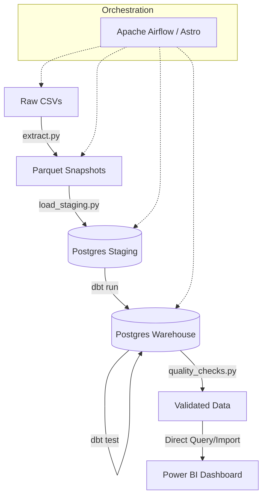
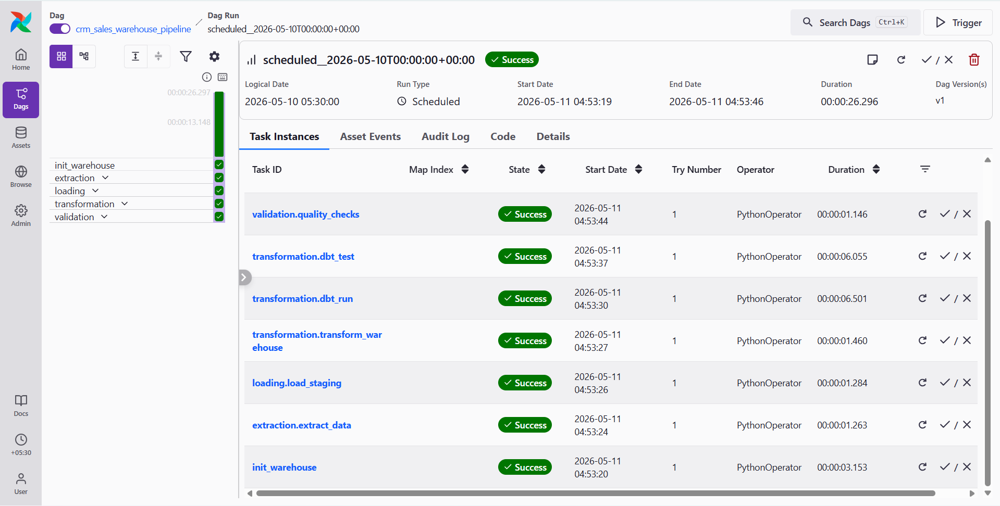
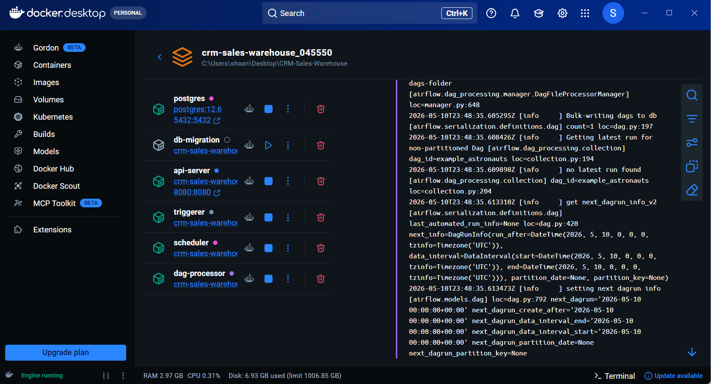
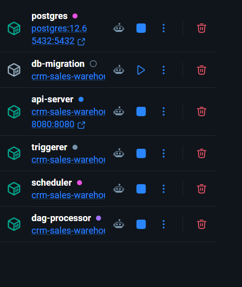
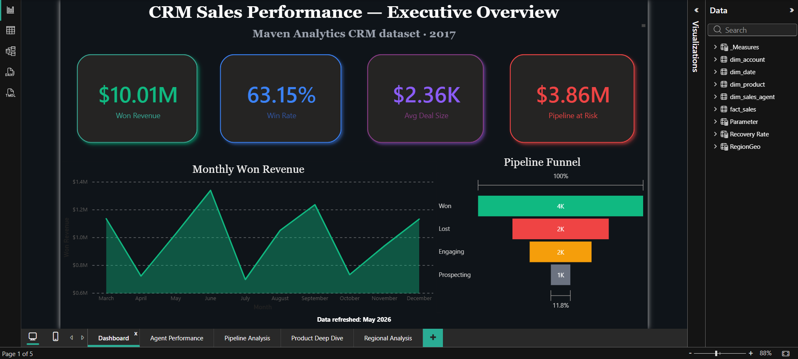
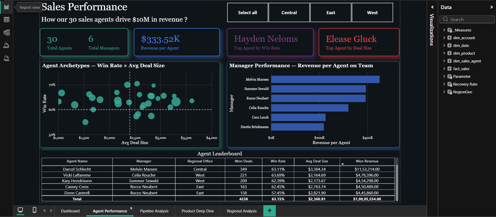
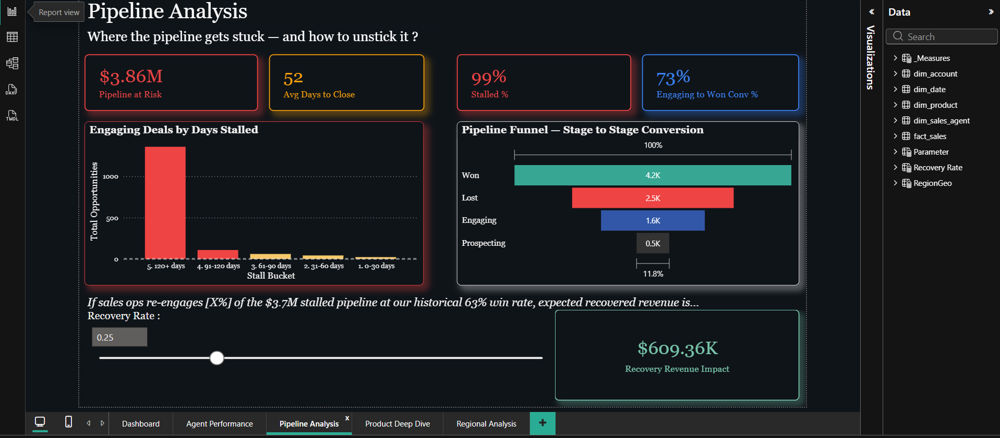
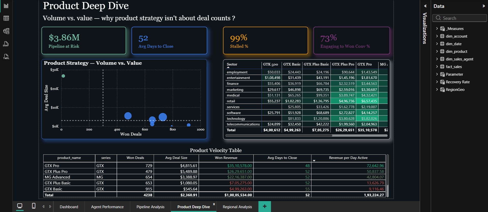
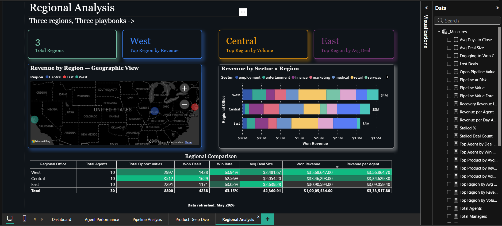
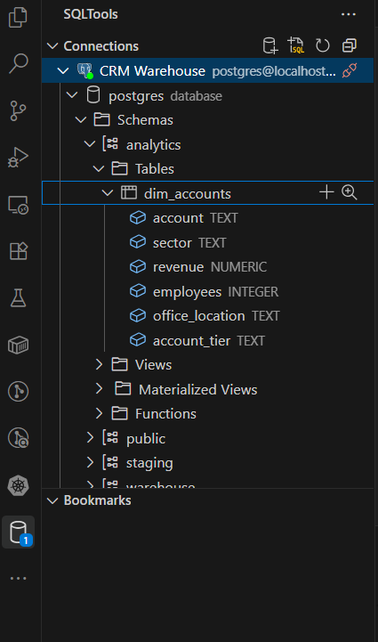

# CRM + Sales Warehouse: End-to-End Data Platform

[](https://github.com/shaan-alpha/CRM-Sales-Warehouse/actions/workflows/ci.yml)
[](https://opensource.org/licenses/MIT)
[](https://www.python.org/downloads/release/python-3110/)
[](https://www.getdbt.com/)
[](https://www.astronomer.io/)

A modern, production-grade data engineering project featuring a full ETL/ELT pipeline for the **Maven Analytics CRM + Sales** dataset. This platform extracts raw operational data, transforms it into a robust star schema using **dbt**, and delivers actionable insights through a 5-page **Power BI** executive dashboard.

---

## 🚀 Key Highlights

- **Automated Orchestration**: End-to-end pipeline managed by **Apache Airflow (Astronomer)**.
- **Modular Modeling**: Data transformation layer built with **dbt Core**, ensuring DRY principles and version-controlled SQL.
- **Star Schema Architecture**: Optimized for analytical performance with conformed dimensions and clear fact grain.
- **Enterprise Visualization**: 5-page interactive Power BI report covering executive KPIs, agent performance, and pipeline health.
- **Data Quality Framework**: Multi-stage validation including dbt tests, custom SQL checks, and schema enforcement.
- **Containerized Infrastructure**: Fully portable environment using **Docker** and **Astro CLI**.

---

## 🏗️ Architecture & Monitoring

The pipeline follows a **Medallion-style** approach modified for a Warehouse:
1.  **Staging**: Raw data loaded into Postgres as-is from Parquet snapshots.
2.  **Warehouse (dbt)**: Modular transformations create a cleaned, typed, and modeled Star Schema.
3.  **Reporting**: Power BI consumes the `analytics.*` schema for optimal report performance.

### 🔄 Pipeline Workflow


### 🖥️ Infrastructure Overview
The project is fully containerized, providing a consistent environment for all services including PostgreSQL, Airflow, and pgAdmin.

| Service | Monitoring Tool | Status |
| :--- | :--- | :--- |
| **Airflow** | [Astro UI](http://localhost:8080) | ✅ Active |
| **Database** | [SQLTools / pgAdmin](http://localhost:5050) | ✅ Active |
| **Containers** | [Docker Desktop](https://www.docker.com/products/docker-desktop/) | ✅ Active |

#### Pipeline Success in Airflow

*Visualizing the successful execution of the end-to-end extraction and transformation pipeline.*

#### Infrastructure Stack in Docker

*The full containerized stack including scheduler, worker, and database services.*


*Detailed view of the active service containers.*

---

## 📊 Business Intelligence Dashboard

The final output is a high-impact, 5-page executive report.

### 1. Executive Overview
Won revenue, win rate, average deal size, and at-risk pipeline at a glance. Monthly trend and full pipeline funnel side by side.


### 2. Agent Performance
Detailed breakdown of sales agent efficiency and manager-level performance.


### 3. Pipeline Analysis
Visualizing sales stages, stall rates, and conversion funnels to identify bottlenecks.


### 4. Product Deep Dive & Regional Analysis
Analysis of product performance and geographic revenue distribution.



---

## 🛠️ Tech Stack & Database Design

### 🗄️ Data Warehouse Schema
The database is structured using a Star Schema for optimal query performance. Dimensions like `dim_accounts`, `dim_products`, and `dim_sales_teams` support the central `fact_sales_pipeline`.


*Exploration of the `analytics` schema and dimension tables within VS Code SQLTools.*

| Layer | Technology | Description |
| :--- | :--- | :--- |
| **Orchestration** | [Apache Airflow](https://airflow.apache.org/) | Pipeline scheduling and management via **Astro CLI**. |
| **Transformation** | [dbt Core](https://www.getdbt.com/) | SQL modeling, testing, and documentation for the warehouse. |
| **ETL / Scripting** | [Python 3.11](https://www.python.org/) | `pandas`, `SQLAlchemy`, `PyArrow` for high-performance processing. |
| **Database** | [PostgreSQL 16](https://www.postgresql.org/) | Containerized warehouse with staging and analytical schemas. |
| **Infrastructure** | [Docker](https://www.docker.com/) | Containerization for consistent dev/prod environments. |
| **Visualization** | [Power BI](https://powerbi.microsoft.com/) | Advanced DAX modeling and interactive dashboard design. |

---

## ⚙️ Local Setup

### 1. Prerequisites
- Docker & Docker Compose
- [Astro CLI](https://www.astronomer.io/docs/astro/cli/install-cli)
- Python 3.11+

### 2. Infrastructure Initialization
Run the following to spin up the entire data platform:
```bash
astro dev start
```

### 3. Configuration
Copy the environment template and configure your local credentials:
```bash
cp .env.example .env
```

### 4. Manual Execution (Optional)
If you wish to run components individually:
```bash
# Run dbt transformations
cd crm_warehouse_dbt
dbt run

# Run quality checks
python etl/quality_checks.py
```

---

## 🧪 Data Quality & Testing

We enforce high data standards at every step:
- **dbt Tests**: Primary keys, relationships, and accepted values.
- **Custom Checks**:
    - **Parity**: Row count matching between staging and warehouse.
    - **Freshness**: Ensuring data is up-to-date.
    - **Referential Integrity**: Fact rows must resolve to valid dimensions.
- **Python Quality**: **Ruff** for linting and **Pytest** for transformation logic.

---

## 📜 License & Acknowledgements

- **Data Source**: [Maven Analytics — CRM + Sales](https://mavenanalytics.io/data-playground)
- **License**: [MIT](LICENSE)

---
*Built with ❤️ by Shaan*
