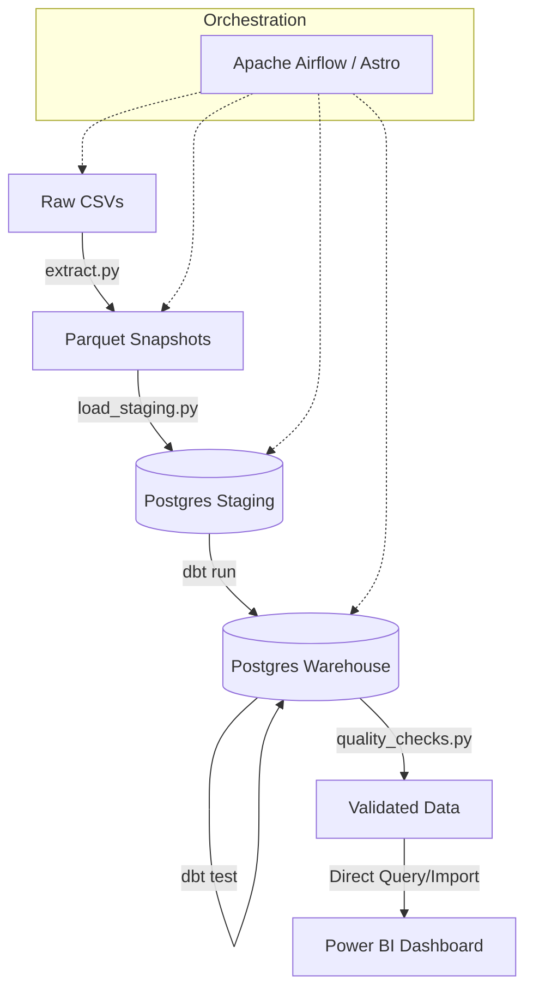

# CRM + Sales Warehouse: End-to-End Data Platform

[](https://github.com/shaan-alpha/CRM-Sales-Warehouse/actions/workflows/ci.yml)
[](https://opensource.org/licenses/MIT)
[](https://www.python.org/downloads/release/python-3110/)
[](https://www.getdbt.com/)
[](https://www.astronomer.io/)

A modern, production-grade data engineering project featuring a full ETL/ELT pipeline for the **Maven Analytics CRM + Sales** dataset. This platform extracts raw operational data, transforms it into a robust star schema using **dbt**, and delivers actionable insights through a 5-page **Power BI** executive dashboard.

---

## 🚀 Key Highlights

- **Automated Orchestration**: End-to-end pipeline managed by **Apache Airflow (Astronomer)**.
- **Modular Modeling**: Data transformation layer built with **dbt Core**, ensuring DRY principles and version-controlled SQL.
- **Star Schema Architecture**: Optimized for analytical performance with conformed dimensions and clear fact grain.
- **Enterprise Visualisation**: 5-page interactive Power BI report covering executive KPIs, agent performance, and pipeline health.
- **Data Quality Framework**: Multi-stage validation including dbt tests, custom SQL checks, and schema enforcement.
- **Containerised Infrastructure**: Fully portable environment using **Docker** and **Astro CLI**.

---

## 🛠️ Tech Stack

| Layer | Technology | Description |
| --- | --- | --- |
| **Orchestration** | [Apache Airflow](https://airflow.apache.org/) | Pipeline scheduling and management via **Astro CLI**. |
| **Transformation** | [dbt Core](https://www.getdbt.com/) | SQL modeling, testing, and documentation for the warehouse. |
| **ETL / Scripting** | [Python 3.11](https://www.python.org/) | `pandas`, `SQLAlchemy`, `PyArrow` for high-performance processing. |
| **Database** | [PostgreSQL 16](https://www.postgresql.org/) | Containerised warehouse with staging and analytical schemas. |
| **Infrastructure** | [Docker](https://www.docker.com/) | Containerisation for consistent dev/prod environments. |
| **Visualization** | [Power BI](https://powerbi.microsoft.com/) | Advanced DAX modeling and interactive dashboard design. |
| **Quality/Linting** | [Ruff](https://beta.ruff.rs/) / [Pytest](https://pytest.org/) | Python code quality and unit testing. |
| **CI/CD** | [GitHub Actions](https://github.com/features/actions) | Automated linting, testing, and DAG validation. |

---

## 🏗️ Architecture



The pipeline follows a **Medallion-style** approach modified for a Warehouse:
1.  **Staging**: Raw data loaded into Postgres as-is from Parquet snapshots.
2.  **Warehouse (dbt)**: Modular transformations create a cleaned, typed, and modeled Star Schema.
3.  **Reporting**: Power BI consumes the `dw.*` schema for optimal report performance.

---

## 📊 Dashboard Overview

The final output is a high-impact, 5-page executive report.

### 1. Executive Overview
Won revenue, win rate, average deal size, and at-risk pipeline at a glance. Monthly trend and full pipeline funnel side by side.


### 2. Agent Performance
How 30 agents and 6 managers drive the revenue. Win-rate × deal-size archetypes, manager-level revenue per agent, and a sortable agent leaderboard.


### 3. Pipeline Analysis
Where the pipeline gets stuck and how to unstick it. Stalled-deal histogram, stage-to-stage funnel, and an interactive recovery-rate slider.


### 4. Product Deep Dive
Volume vs. value — why product strategy isn't about deal counts. Velocity table ranking products by revenue per active day.


### 5. Regional Analysis
Geographic revenue map, sector × region stacked bars, and a regional comparison table covering key efficiency metrics.


---

## 📁 Project Structure

```text
crm-sales-warehouse/
├── .astro/                     # Astronomer CLI configuration
├── .github/workflows/          # CI/CD (GitHub Actions)
├── crm_warehouse_dbt/          # dbt project (models, macros, tests)
├── dags/                       # Airflow DAG definitions
├── etl/                        # Core ETL logic
│   ├── extract.py              # CSV to Parquet snapshots
│   ├── load_staging.py         # Parquet to Postgres staging
│   ├── dbt_runner.py           # Helper to trigger dbt from Airflow
│   └── quality_checks.py       # Custom SQL validation logic
├── powerbi/                    # Power BI .pbix source file
├── sql/                        # Raw SQL (DDL, manual transforms)
├── data/                       # Local data storage (gitignored)
│   ├── raw/                    # Input CSVs
│   └── staging/                # Cleaned Parquet files
├── docker-compose.yml          # Infrastructure setup (Postgres + pgAdmin)
└── requirements.txt            # Python dependencies
```

---

## ⚙️ Local Setup

### 1. Prerequisites
- Docker & Docker Compose
- [Astro CLI](https://www.astronomer.io/docs/astro/cli/install-cli) (Recommended for full pipeline)
- Python 3.11+

### 2. Infrastructure
Choose your running mode:
- **Full Suite (Airflow + Postgres)**:
  ```bash
  astro dev start
  ```
- **Warehouse Only (Postgres + pgAdmin)**:
  ```bash
  docker compose up -d
  ```

### 3. Python Environment
```bash
python -m venv .venv
source .venv/bin/activate  # Or .venv\Scripts\Activate.ps1 on Windows
pip install -r requirements.txt
```

### 4. Configuration
Create a `.env` file based on `.env.example`:
```bash
POSTGRES_USER=crm_user
POSTGRES_PASSWORD=crm_password
POSTGRES_DB=crm_warehouse
```

### 5. Initialize & Run
1.  Place raw CSVs in `data/raw/`.
2.  Access Airflow at `localhost:8080` and trigger the `crm_sales_warehouse_pipeline` DAG.
3.  Alternatively, run dbt manually:
    ```bash
    cd crm_warehouse_dbt
    dbt run
    ```

---

## 🧪 Data Quality & Testing

We enforce high data standards at every step:
- **dbt Tests**: Primary keys, relationships, and accepted values.
- **Custom Checks**:
    - **Parity**: Row count matching between staging and warehouse.
    - **Freshness**: Ensuring data is up-to-date.
    - **Referential Integrity**: Fact rows must resolve to valid dimensions.
- **Python Quality**: **Ruff** for linting and **Pytest** for transformation logic.

---

## 🔧 Troubleshooting

- **dbt Pathing**: If running `dbt` from Airflow tasks fails, ensure the `DBT_PROJECT_DIR` in `etl/dbt_runner.py` matches your environment (default is set for Astro Docker).
- **Postgres Connection**: If you cannot connect to Postgres from your host, ensure `localhost:5432` is not occupied and the container is healthy (`docker ps`).
- **CSV Format**: Ensure CSV files from Maven Analytics are unmodified to prevent schema mismatch in `extract.py`.

---

## 📜 License & Acknowledgements

- **Data Source**: [Maven Analytics — CRM + Sales](https://mavenanalytics.io/data-playground)
- **License**: [MIT](LICENSE)

---
*Built with ❤️ by Shaan*
