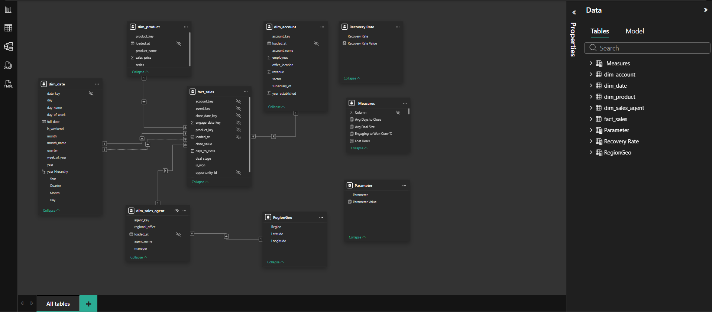

# CRM + Sales Warehouse

End-to-end data engineering project on the **Maven Analytics CRM + Sales** dataset. Raw operational CSVs are extracted, cleaned, and loaded into a containerised Postgres warehouse. The pipeline is orchestrated by **Apache Airflow (Astronomer)**, modeled with **dbt**, validated with SQL quality checks, and surfaced through a five-page Power BI executive dashboard.

**Stack:** Python 3.11 · Airflow · dbt · PostgreSQL 16 · Docker · Power BI

## Status

**✅ Complete.** Pipeline runs end-to-end and the dashboard ships in [`powerbi/powerbicrm_dashboard.pbix`](powerbi/powerbicrm_dashboard.pbix).

## Dashboard

A five-page executive dashboard built on the warehouse star schema.

### 1. Executive Overview

Won revenue, win rate, average deal size, and at-risk pipeline at a glance. Monthly trend and full pipeline funnel side by side.


### 2. Agent Performance

How 30 agents and 6 managers drive the revenue. Win-rate × deal-size archetypes, manager-level revenue per agent, and a sortable agent leaderboard.


### 3. Pipeline Analysis

Where the pipeline gets stuck and how to unstick it. Stalled-deal histogram, stage-to-stage funnel, and an interactive recovery-rate slider that projects revenue impact in real time.


### 4. Product Deep Dive

Volume vs. value — why product strategy isn't about deal counts. Scatter of won-deals × avg deal size, sector × product revenue heatmap, and a velocity table ranking products by revenue per active day.


### 5. Regional Analysis

Three regions, three playbooks. Geographic revenue map, sector × region stacked bars, and a regional comparison table covering agents, opportunities, win rate, deal size, and revenue per agent.


### Data Model

Star schema directly from the warehouse (`dw.*` schema in Postgres) — five dimensions and one fact, plus calculation groups (`_Measures`), recovery-rate parameter, and a `RegionGeo` lookup for the map.



## Architecture

```
CSV (data/raw)
      │  extract.py
      ▼
Parquet snapshots (data/staging)
      │  load_staging.py
      ▼
Postgres · staging schema
      │
      ▼
┌──────────────────────────┐
│    Apache Airflow        │
│    (Orchestration)       │
└──────────┬───────────────┘
           │
           ▼
┌──────────────────────────┐
│         dbt              │
│    (Transformation)      │
└──────────┬───────────────┘
           │
           ▼
Postgres · warehouse schema (star)
      │  quality_checks.py
      ▼
Power BI Desktop  →  powerbi/powerbicrm_dashboard.pbix
```

The pipeline is managed by **Astronomer (Airflow)**. The DAG defined in [`dags/crm_sales_pipeline.py`](dags/crm_sales_pipeline.py) orchestrates the end-to-end flow, while **dbt** (in [`crm_warehouse_dbt/`](crm_warehouse_dbt/)) handles the modular transformations within the warehouse.

## Star schema

| Layer | Tables |
| --- | --- |
| **Staging** (`stg.*`) | `accounts`, `products`, `sales_pipeline`, `sales_teams` — typed, deduped Parquet → Postgres |
| **Warehouse** (`dw.*`) | `dim_date`, `dim_account`, `dim_product`, `dim_sales_agent`, `fact_sales`, plus `RegionGeo` lookup |

Surrogate keys on every dim, conformed `date_key` across the model, fact grain = one row per opportunity in the sales pipeline.

## Project structure

```
crm-sales-warehouse/
├── .astro/                     # Astronomer CLI config
├── .github/workflows/          # CI/CD (GitHub Actions)
├── crm_warehouse_dbt/          # dbt project for warehouse modeling
├── dags/                       # Airflow DAGs
├── etl/
│   ├── extract.py              # CSV → cleaned parquet snapshots
│   ├── load_staging.py         # parquet → Postgres staging
│   ├── transform_warehouse.py  # (Legacy) staging → star schema
│   ├── quality_checks.py       # row counts, nulls, PK/FK, freshness
│   ├── run_pipeline.py         # (Legacy) orchestrator
│   └── utils/
│       ├── db.py               # SQLAlchemy engine + Postgres connection helpers
│       └── logger.py
├── sql/                        # Raw SQL for legacy transforms and checks
├── powerbi/
│   └── powerbicrm_dashboard.pbix   # final 5-page Power BI report
├── data/
│   ├── raw/                    # input CSVs (gitignored)
│   ├── staging/                # parquet snapshots (gitignored)
│   └── archive/                # historical pipeline runs (gitignored)
├── docs/
│   ├── data_dictionary.csv     # column-level definitions
│   ├── roadmap.md              # build journal
│   └── screenshots/            # dashboard screenshots
├── docker-compose.yml          # Postgres 16 + pgAdmin
├── Dockerfile                  # Astro runtime image
├── requirements.txt
├── .env.example
└── README.md
```

## Data

Source: [Maven Analytics — CRM + Sales](https://mavenanalytics.io/data-playground)

Place these files in `data/raw/` (gitignored):
- `accounts.csv`
- `products.csv`
- `sales_pipeline.csv`
- `sales_teams.csv`

Column-level definitions live in [`docs/data_dictionary.csv`](docs/data_dictionary.csv).

## Run it locally

### 1. Start Infrastructure

You can run the warehouse alone via Docker Compose, or the full orchestration suite via Astro.

**Option A: Simple (Postgres + pgAdmin)**
```powershell
docker compose up -d
```

**Option B: Full (Airflow + Postgres)**
```powershell
astro dev start
```

### 2. Set up Python & dbt

```powershell
python -m venv .venv
.\.venv\Scripts\Activate.ps1
pip install -r requirements.txt
# Install dbt-postgres if not present
pip install dbt-postgres
copy .env.example .env
```

### 3. Initialize dbt

```powershell
cd crm_warehouse_dbt
dbt debug
dbt run
```

### 4. Drop the CSVs

Place the four Maven Analytics CSVs in `data/raw/`.

### 5. Run the Airflow Pipeline

Access the Airflow UI at `localhost:8080` (default: `admin`/`admin`) and trigger the `crm_sales_warehouse_pipeline` DAG.

## CI/CD

This project uses **GitHub Actions** for:
- **Linting**: Ruff for Python code quality.
- **Testing**: Pytest for ETL logic.
- **Validation**: Automated DAG integrity checks.

See [`.github/workflows/ci.yml`](.github/workflows/ci.yml) for details.

## Data-quality checks

Every pipeline run validates:

- **Row counts** — staging vs. warehouse parity per source table
- **Null discipline** — no nulls on primary-key columns or required dimension attributes
- **Referential integrity** — every fact row resolves to a valid dim
- **Freshness** — most-recent `close_date` in `fact_sales` is within an expected window
- **Domain checks** — sector spelling normalised (`technolgy` → `technology`), deal stages limited to the known enum (Won / Lost / Engaging / Prospecting)

A failed check halts the pipeline before the warehouse is updated.

## Tools used

| Layer | Tool |
| --- | --- |
| Source | Maven Analytics CRM + Sales (CSV) |
| Extract / load / transform | Python 3.11, pandas, pyarrow, SQLAlchemy |
| Database | PostgreSQL 16 (Docker) |
| Admin | pgAdmin 4 (Docker) |
| Quality | Plain SQL via `psycopg2` |
| Visualisation | Power BI Desktop |
| Container runtime | Docker Compose |

## License

[MIT](LICENSE)
